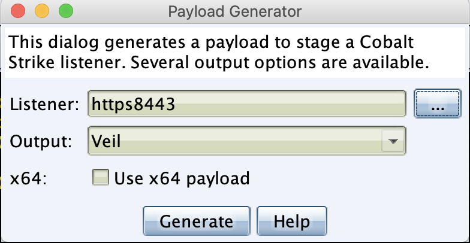
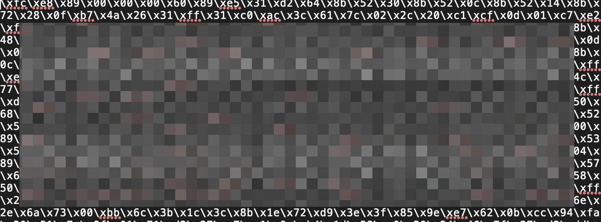

# CobaltStrike BypassAV上线之--uuid-loader

### CS生成payload

    生成veil格式的shellcode，以"\x"分隔的十六进制txt文件





### go-uuid-loader生成加载脚本

    根据loader-model模板生成go或csharp加载脚本，然后可将该脚本进行编译成exe可执行文件。

```go
    #loader编译
    go build -ldflags "-w -s -H windowsgui" GO_UUID.go
```

```cmd
    #loader编译
    csc.exe /t:exe /platform:x86 /out:exe /winicon:a.icon loader.csharp
```

### 工具使用

    工具在命令行下使用，可编译成相应系统的可执行文件。shellcode2uuid.go是将shellcode转成uuid字符串。loader-model下为loader脚本模板。

```bash
├── DInvoke.dll
├── README.md
├── genshellcode
│   └── shellcode2uuid.go
├── go.mod
├── go.sum
├── imgs
│   ├── loader_option.png
│   ├── mask_xcode.png
│   └── payload_gen.png
├── loader-model
│   ├── csharp_uuid_loader.cs
│   └── go_uuid_loader.go
├── output
│   └── gloader.go
└── shellcodetouuid.go
```

    本工具主要有以下选项。
```bash
  -d string
        根据模板输出的loader文件
  -s string
        shellcode源文件，以\\x分隔的txt文件
  -t string
        生成loader文件的模板,默认为go，目前支持go、csharp (default "go")
```

    本工具是根据YanMu2020改编的。
    > https://github.com/YanMu2020/uuid_go_loder